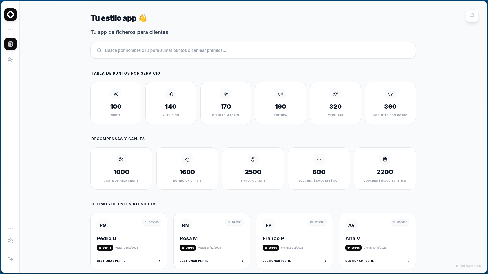

  
  <h1>Tu Estilo App</h1>
  

    <strong>Tu app de ficheros para clientes de peluquería.</strong>
  

  <!-- Badges -->
  

    
    
    
    
    
  

  

    
    
    
    
    
  

---

## Descripción 

**Tu Estilo App** es una aplicación de escritorio diseñada específicamente para peluquerías y salones de belleza que desean gestionar sus clientes de manera profesional y moderna. Ofrece un sistema completo de ficheros de clientes con programa de fidelización mediante puntos, permitiendo registrar servicios, acumular puntos por cada atención y canjear recompensas. Su interfaz minimalista y moderna garantiza una experiencia de usuario fluida, con búsqueda rápida, notificaciones de cumpleaños y persistencia de datos local mediante SQLite.

 

  
  
<em>Vista general del dashboard de clientes</em>

 

## Funcionalidades

### Gestión de Clientes
*   **Registro Completo**: Creación de fichas de clientes con nombre, apellido, ID único, fecha de nacimiento, teléfono y correo electrónico.
*   **Búsqueda Inteligente**: Sistema de búsqueda en tiempo real por nombre o ID de cliente con resultados instantáneos.
*   **Historial de Visitas**: Registro automático de la última visita de cada cliente para seguimiento personalizado.
*   **Notificaciones de Cumpleaños**: Sistema de alertas que muestra los clientes que cumplen años el día actual.

### Sistema de Puntos de Lealtad
*   **Acumulación de Puntos**: Tabla de puntos por servicio (Corte: 100pts, Nutrición: 140pts, Células madres: 170pts, Tintura: 190pts, Mechitas: 320pts, Mechitas con gorro: 360pts).
*   **Gestión de Puntos**: Suma y resta de puntos desde el perfil de cada cliente con registro de transacciones.
*   **Sistema de Canjes**: Recompensas configuradas (Corte gratis: 1000pts, Nutrición gratis: 1600pts, Tintura gratis: 2500pts, Voucher $5.000: 600pts, Voucher $15.000: 2200pts).
*   **Historial de Transacciones**: Visualización completa del historial de puntos ganados y canjeados por cliente.

### Interfaz y Experiencia
*   **Dashboard Moderno**: Vista principal con últimos clientes atendidos, tabla de puntos por servicio y recompensas disponibles.
*   **Diseño Minimalista**: Interfaz limpia en blanco y negro con acentos de color, optimizada para uso diario en salones.
*   **Animaciones Fluidas**: Transiciones suaves y micro-interacciones que mejoran la experiencia de usuario.
*   **Persistencia Local**: Guardado automático de todos los datos en base de datos SQLite sin necesidad de conexión a internet.

---

## Flujo de Trabajo

Optimiza la atención a tus clientes con este flujo simple:

| Acción | Descripción |
| :--- | :--- |
| **Búsqueda de Cliente** | Utiliza la barra de búsqueda para encontrar al cliente por nombre o ID |
| **Registro de Servicio** | Selecciona el servicio realizado y suma los puntos correspondientes |
| **Canje de Recompensas** | Cuando el cliente tenga puntos suficientes, canjea premios desde su perfil |
| **Nuevo Cliente** | Accede a "Agregar Cliente" desde el menú lateral para registrar nuevos clientes |
| **Cumpleaños** | Revisa el ícono de notificación para ver clientes que cumplen años hoy |

---

  
Desarrollado por <strong>Diego Ledesma</strong>

  
<em>Versión 1.0.0 - Enero 2026</em>

